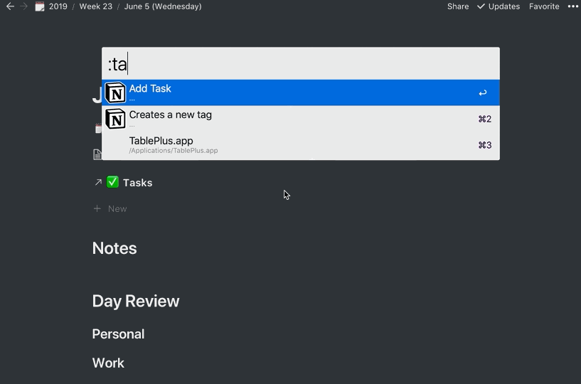

Last month I wrote about [[../My Weekly Notion Setup/My Weekly Notion Setup|My Weekly Notion Setup]] and how I use it to help organize my life.

> [Click to get my Weekly Notion Template](https://kevinjalbert-shared-templates.notion.site/Week-Template-9d2dba2d4c164defb57cf8ff4299fc0c)

I like to use tools that are an extension of my hand and mind. If the tool does not bend to my will then I need to tailor it to do so. I've done this many times before, to which I normally share the end result (i.e., [[../Synchronizing my dotfiles/Synchronizing my dotfiles|how I synchronize my dotfiles]], [[../Todoist with Keyboard Navigation via Nativefier/Todoist with Keyboard Navigation via Nativefier|adding keyboard navigation to Todoist on MacOS]], amongst other examples).

This month, I want to share how I integrate my [Notion [Referral]](https://www.notion.so/?r=6b8d609eb50943419db4d87c67fa558e) setup with [Alfred](https://www.alfredapp.com/). At the time of publication, Notion has not yet released an official API. I ended up taking advantage of [`notion-py`](https://github.com/jamalex/notion-py) -- an unofficial Python API client for Notion. With various Python scripts, I was able to connect everything together in an Alfred Workflow (as seen in the post's title image).

# Added Extensions

I mainly wanted to bypass the need for direct interaction with Notion, so that I could avoid excessive context switching. I was able to put together the following _actions_ in Alfred:

- **:week**
  - This keyword will open Notion to the current week.
- **:day**
  - This keyword will open Notion to the current day.
- **:note**
  - This keyword allows me to append a text block at the end of my current day's notes section.
- **:tag**
  - This keyword allows me to create a new tag in my tags database.
- **:win**
  - This keyword allows me to create a new win in my wins database.
- **:task**
  - This keyword allows me to create a new task in my tasks database.
- **:search**
  - This keyword allows me to search my current day's tasks, and be able to open it in Notion or change its status.

The end result allows me to do stuff like the following:

> [Watch a video with more detail](https://www.youtube.com/watch?v=i_Ce3ogyuTA)

# How do I get this?

I've published the Alfred Workflow and Python scripts in a [repository on GitHub at `alfred-notion`](https://github.com/kevinjalbert/alfred-notion). For the most part, you can follow the instructions laid out in the `README.md` as it'll be up to date with new changes.

> [Click to check out `alfred-notion`](https://github.com/kevinjalbert/alfred-notion)

I like to remind everyone that this is _my tailored solution_ on how I've integrated Notion to fit _my needs_. If you want to use my solution as inspiration or as a foundation, everything is open sourced. If you want to use it verbatim, then don't forget to get the weekly template.

**NOTE:** [v1.0.0](https://github.com/kevinjalbert/notion-toolbox/tree/9582299d7b4022f2d0f8debf72827b840634eefd) is current at the time of publication (June 16, 2019).
